# ROV Workspace - Comprehensive Technical Audit Report

> **Date**: January 29, 2026  
> **Scope**: Full technical audit of ROV control system  
> **Components**: WPF GUI Control, STM32F405RGT6 Firmware, Python Bridge Scripts

---

## Executive Summary

The ROV Workspace is a multi-component robotics control system consisting of a Windows desktop GUI, embedded STM32 firmware, and Python communication scripts. While the architecture is sound, there are **critical bugs that will prevent the system from functioning**, along with security vulnerabilities and code quality issues that need addressing.

> [!CAUTION]
> **Critical Finding**: The MAVLink command transmission is **completely disabled** in [MAVLinkHandler.cs](file:///e:/Robotics%20Team/ROV/ROV%20Workspace/ROV%20GUI%20Control/ViewModels/MAVLinkHandler.cs#L110-L117), meaning all control commands from the GUI are never sent to the ROV.

---

## System Architecture Overview

```mermaid
graph TD
    subgraph "Windows PC"
        GUI[WPF GUI Control<br/>.NET 4.7.2]
        JS[Joystick Input<br/>SharpDX DirectInput]
        CAM[Camera Receivers<br/>UDP Streams]
    end
    
    subgraph "Raspberry Pi"
        BRIDGE[bridge.py<br/>UART↔UDP]
        STREAM[stream.py<br/>Camera Flask Server]
    end
    
    subgraph "STM32F405RGT6"
        MAV[MAVLink Parser]
        MOTOR[Motor Interface<br/>PWM Control]
        SENSORS[Sensors<br/>IMU + Pressure]
        PID[PID Controller]
    end
    
    GUI -->|MAVLink/UDP| BRIDGE
    JS -->|MAVLink/UDP| BRIDGE
    BRIDGE -->|UART 115200| MAV
    MAV --> MOTOR
    MAV --> SENSORS
    SENSORS --> PID
    PID --> MOTOR
    STREAM -->|HTTP MJPEG| CAM
```



---

## 1. Critical Bugs (Must Fix)

### 🔴 1.1 MAVLink Commands Never Sent

**File**: [MAVLinkHandler.cs](file:///e:/Robotics%20Team/ROV/ROV%20Workspace/ROV%20GUI%20Control/ViewModels/MAVLinkHandler.cs#L110-L117)

```csharp
public async Task SendCommand(byte[] packet)
{
    await Task.Run(async () =>
    {
        bool one = await ConnectionCheck();
        //UDPClient.Send(packet, packet.Length, RemoteEP); // ⚠️ COMMENTED OUT!
    });
}
```

**Impact**: GUI control commands, PID parameters, arm/disarm, and all MAVLink messages are **never transmitted** to the ROV.

**Fix**:
```diff
public async Task SendCommand(byte[] packet)
{
    await Task.Run(async () =>
    {
        bool connected = await ConnectionCheck();
-       //UDPClient.Send(packet, packet.Length, RemoteEP);
+       if (connected)
+       {
+           UDPClient.Send(packet, packet.Length, RemoteEP);
+       }
    });
}
```

---

### 🔴 1.2 Semaphore Never Acquired Before Release

**File**: [MainViewModel.cs](file:///e:/Robotics%20Team/ROV/ROV%20Workspace/ROV%20GUI%20Control/ViewModels/MainViewModel.cs#L245-L276)

```csharp
private async void UpdateStatus(string message)
{
    await App.Current.Dispatcher.InvokeAsync(() =>
    { 
        try { /* ... */ }
        finally
        {
            _semaphore.Release(); // ⚠️ Never acquired!
        }
    }, DispatcherPriority.Background);
}
```

**Impact**: `SemaphoreSlim.Release()` called without corresponding `WaitAsync()` will throw `SemaphoreFullException` after 2+ status messages.

**Fix**:
```diff
private async void UpdateStatus(string message)
{
+   await _semaphore.WaitAsync();
    await App.Current.Dispatcher.InvokeAsync(() =>
    { 
        try { /* ... */ }
        finally
        {
            _semaphore.Release();
        }
    }, DispatcherPriority.Background);
}
```

---

### 🔴 1.3 Unreachable Motor Initialization Code

**File**: [main.c](file:///e:/Robotics%20Team/ROV/ROV%20Workspace/STM32F405RGT6/Core/Src/main.c#L76-L95)

```c
osKernelInitialize();
defaultTaskHandle = osThreadNew(StartDefaultTask, NULL, &defaultTask_attributes);
osKernelStart();  // ⚠️ Never returns!

Motors_Init_Values();     // Never executed
Motor_Set_timer(0, ...);  // Never executed
// ... all subsequent initialization
```

**Impact**: All motor, MAVLink, IMU, and pressure sensor initialization **never occurs**. The ROV firmware is non-functional.

**Fix**: Move all initialization code before `osKernelStart()`:
```diff
  osKernelInitialize();
+ 
+ // All initialization must happen BEFORE osKernelStart()
+ Motors_Init_Values();
+ Motor_Set_timer(0, &htim1, 1);
+ // ... rest of motor setup
+ Set_mavlink(&huart2, 1, 1);
+ Start_UART_DMA_Receive();
+ if(!MPU6050_Init()){}
+ Pressure_sensor_Setup(&hspi1, &htim2);
+ Pressure_sensor_Init();
+ System_Init();
+ 
  defaultTaskHandle = osThreadNew(StartDefaultTask, NULL, &defaultTask_attributes);
  osKernelStart(); // Never returns - code below unreachable
```

---

### 🔴 1.4 Empty Main Loop with Commented Processing

**File**: [main.c](file:///e:/Robotics%20Team/ROV/ROV%20Workspace/STM32F405RGT6/Core/Src/main.c#L100-L121)

```c
while (1)
{
    /* All processing is commented out:
     - pressure_update_flag processing
     - imu_update_flag processing
     - MavlinkTx_Process()
    */
}
```

**Impact**: Even if the initialization worked, the main loop does nothing. No sensor updates, no telemetry transmission.

---

### 🔴 1.5 10-Second Blocking ESC Calibration

**File**: [motor_interface.c](file:///e:/Robotics%20Team/ROV/ROV%20Workspace/STM32F405RGT6/Core/Src/motor_interface.c#L47)

```c
void Motor_CalibrateESC(uint8_t motor_id)
{
    // ... PWM setup ...
    HAL_Delay(10000);  // ⚠️ Blocks for 10 seconds!
    IsCalibratedESC = true;
}
```

**Impact**: With FreeRTOS, using `HAL_Delay()` in a non-task context blocks the entire system. Should use `osDelay()` in a task or move calibration to a FreeRTOS task.

---

## 2. Security Vulnerabilities

### 🟠 2.1 Hardcoded Credentials

**Files**: 
- [MainViewModel.cs](file:///e:/Robotics%20Team/ROV/ROV%20Workspace/ROV%20GUI%20Control/ViewModels/MainViewModel.cs#L826-L838) - SSH credentials passed to constructor
- [bridge.py](file:///e:/Robotics%20Team/ROV/ROV%20Workspace/bridge.py#L10) - Hardcoded IP `192.168.0.132`

```csharp
public MainViewModel(string username, string password, IWindowService windowService)
{
    Host_IP = "192.168.0.0";  // Hardcoded
    UserName = username;
    Password = password;  // Stored in memory as plain text
    // ...
}
```

**Recommendation**:
- Store credentials in encrypted settings file or Windows Credential Manager
- Use SSH key-based authentication
- Make IP addresses configurable via settings

---

### 🟠 2.2 SSH Commands Without Validation

**File**: [MainViewModel.cs](file:///e:/Robotics%20Team/ROV/ROV%20Workspace/ROV%20GUI%20Control/ViewModels/MainViewModel.cs#L64-L67)

```csharp
ssh.RunCommand("pkill -f bridge.py");
ssh.RunCommand("nohup python3 /home/rov/main.py > /dev/null 2>&1 &");
```

**Risk**: Remote command execution with hardcoded paths. If compromised, could execute arbitrary commands.

**Recommendation**: Validate commands server-side or use a restricted API.

---

## 3. Performance Issues

### 🟡 3.1 UDP Camera Stream Missing Chunked Reassembly

**File**: [CAMStream.cs](file:///e:/Robotics%20Team/ROV/ROV%20Workspace/ROV%20GUI%20Control/ViewModels/CAMStream.cs#L55-L86)

```csharp
var result = await UDPReceiver.ReceiveAsync();
// Assumes each UDP packet is a complete JPEG frame
using var ms = new MemoryStream(result.Buffer);
```

**Compare to sender**: [udp_streamer.py](file:///e:/Robotics%20Team/ROV/ROV%20Workspace/udp_streamer.py#L29-L33) which splits frames:

```python
for i in range(0, len(data), MAX_DATAGRAM_SIZE):
    chunk = data[i:i+MAX_DATAGRAM_SIZE]
    sock.sendto(chunk, (UDP_IP, UDP_PORT))
```

**Impact**: Large JPEG frames split across multiple UDP packets will cause corrupted images.

**Fix**: Implement packet reassembly with frame markers or use HTTP MJPEG stream instead ([stream.py](file:///e:/Robotics%20Team/ROV/ROV%20Workspace/stream.py) already provides this).

---

### 🟡 3.2 Dispatcher Flooding

**File**: [MainViewModel.cs](file:///e:/Robotics%20Team/ROV/ROV%20Workspace/ROV%20GUI%20Control/ViewModels/MainViewModel.cs#L232-L310)

Multiple `Dispatcher.InvokeAsync()` calls for every telemetry update at high frequency can overwhelm the UI thread.

**Recommendation**: Implement rate limiting (e.g., update UI max 30 times/second) or batch updates.

---

### 🟡 3.3 Division by Zero in Joystick Handler

**File**: [JOYStick.cs](file:///e:/Robotics%20Team/ROV/ROV%20Workspace/ROV%20GUI%20Control/ViewModels/JOYStick.cs#L204)

```csharp
int speed = (int)(312*(Math.Abs(x) + Math.Abs(y) + Math.Abs(z)) 
    /(Math.Abs(xn-1) + Math.Abs(yn-1) + Math.Abs(zn-1)));  // ⚠️ Division by zero possible!
```

**Impact**: If `xn=1, yn=1, zn=1`, denominator is 0.

**Fix**:
```csharp
int denominator = Math.Abs(xn-1) + Math.Abs(yn-1) + Math.Abs(zn-1);
int speed = denominator > 0 
    ? (int)(312*(Math.Abs(x) + Math.Abs(y) + Math.Abs(z)) / denominator)
    : 0;
```

---

## 4. Poor Coding Practices

### 🔵 4.1 Duplicate INotifyPropertyChanged Implementation

**File**: [MainViewModel.cs](file:///e:/Robotics%20Team/ROV/ROV%20Workspace/ROV%20GUI%20Control/ViewModels/MainViewModel.cs#L26)

```csharp
public class MainViewModel : ObservableObject, INotifyPropertyChanged, IDisposable
```

`ObservableObject` from CommunityToolkit.Mvvm already implements `INotifyPropertyChanged`. The duplicate implementation at line 989-991 is redundant.

---

### 🔵 4.2 Fire-and-Forget Async Calls

Multiple instances of `_ = SomeAsyncMethod()` without exception handling:

```csharp
_ = StartAllAsync();  // Line 496
_ = FeedChange(1);    // Line 530
```

**Recommendation**: Use proper async/await or log unhandled exceptions:
```csharp
StartAllAsync().ContinueWith(t => 
    Log.Error(t.Exception), TaskContinuationOptions.OnlyOnFaulted);
```

---

### 🔵 4.3 Unreliable Error Handling in Python Scripts

**Files**: [bridge.py](file:///e:/Robotics%20Team/ROV/ROV%20Workspace/bridge.py), [stream.py](file:///e:/Robotics%20Team/ROV/ROV%20Workspace/stream.py)

No reconnection logic if serial port disconnects or camera fails.

```python
# bridge.py
except KeyboardInterrupt:
    print("\n[!] Stopping bridge...")
# Missing: except serial.SerialException, socket.error
```

---

### 🔵 4.4 Missing NULL Checks in Firmware

**File**: [motor_interface.c](file:///e:/Robotics%20Team/ROV/ROV%20Workspace/STM32F405RGT6/Core/Src/motor_interface.c#L77-L83)

```c
void Motor_SetSpeed(uint8_t motor_id, int16_t speed)
{
    if(thrusters_enabled)
    {
        __HAL_TIM_SET_COMPARE(motors[motor_id].htim, ...);
        // ⚠️ No check if motor_id < MAX_MOTORS
        // ⚠️ No check if htim is valid pointer
    }
}
```

---

## 5. Missing Components & Setup Issues

### 📁 5.1 Missing Files

| File               | Expected Location         | Purpose                        |
| ------------------ | ------------------------- | ------------------------------ |
| `main.py`          | `/home/rov/main.py` (RPi) | Camera streaming master script |
| `requirements.txt` | Root directory            | Python dependencies            |
| `.gitignore`       | Root directory            | Version control excludes       |
| `README.md`        | Root directory            | Project documentation          |

---

### 📁 5.2 Unused Dependencies

**File**: [packages.config](file:///e:/Robotics%20Team/ROV/ROV%20Workspace/ROV%20GUI%20Control/packages.config)

- `Microsoft.VisualBasic` - Not used anywhere in codebase
- `OxyPlot.Core.Drawing` - Likely unnecessary (WPF uses OxyPlot.Wpf directly)

---

## 6. Dependency Vulnerabilities

| Package             | Current   | Risk   | Notes                                    |
| ------------------- | --------- | ------ | ---------------------------------------- |
| `Core.Renci.SshNet` | 2021.10.2 | Medium | Old fork, use official `SSH.NET` instead |
| `Newtonsoft.Json`   | 13.0.3    | Low    | Update to latest for security patches    |
| `SharpDX`           | 4.2.0     | Low    | Deprecated, consider XInput wrapper      |

---

## 7. Architecture Recommendations

### 7.1 Introduce Configuration File

Create `appsettings.json` for all configurable parameters:

```json
{
  "Connection": {
    "Host": "192.168.0.100",
    "MavlinkPort": 14550,
    "CameraPorts": [5000, 6000, 7000]
  },
  "PID": {
    "Speed": { "Kp": 1.0, "Ki": 0.0, "Kd": 0.08 }
  }
}
```

---

### 7.2 Add Logging Framework

Replace `Console.WriteLine` with structured logging:

```csharp
using Microsoft.Extensions.Logging;

// Already have log4net in dependencies but not configured
```

---

### 7.3 Unit Tests

Create test project targeting critical logic:
- PID parameter validation
- MAVLink packet serialization
- Motor speed calculations
- Joystick input mapping

---

## Summary of Required Actions

| Priority   | Issue                          | Component | Effort |
| ---------- | ------------------------------ | --------- | ------ |
| 🔴 Critical | Uncomment UDP send             | GUI       | 5 min  |
| 🔴 Critical | Fix semaphore usage            | GUI       | 10 min |
| 🔴 Critical | Move init before osKernelStart | Firmware  | 30 min |
| 🔴 Critical | Uncomment main loop code       | Firmware  | 10 min |
| 🟠 High     | Externalize credentials        | GUI       | 2 hrs  |
| 🟠 High     | Fix UDP reassembly             | GUI       | 4 hrs  |
| 🟡 Medium   | Add division by zero check     | GUI       | 10 min |
| 🟡 Medium   | Rate limit UI updates          | GUI       | 1 hr   |
| 🔵 Low      | Remove duplicate interface     | GUI       | 5 min  |
| 🔵 Low      | Add null checks                | Firmware  | 1 hr   |

---

*Report generated by technical audit. All line numbers reference source files as of January 29, 2026.*
